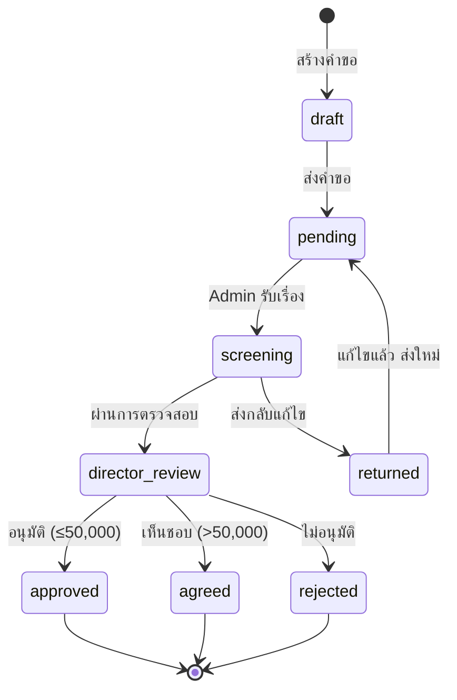
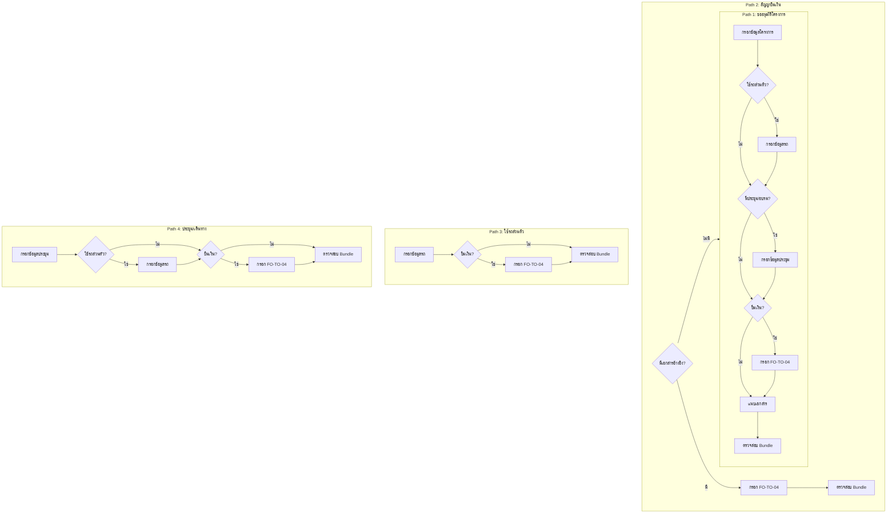

# RSC Smart Approval - ER Diagram

## Entity Relationship Diagram

```mermaid
erDiagram
    %% ==========================================
    %% USER & ORGANIZATION ENTITIES
    %% ==========================================
    
    USER {
        int id PK
        string username UK
        string password_hash
        string email UK
        string title "นาย/นาง/นางสาว/ดร./รศ.ดร."
        string first_name
        string last_name
        string phone
        string id_card "เลขบัตรประชาชน"
        int department_id FK
        int role_id FK
        datetime created_at
        datetime updated_at
        boolean is_active
    }
    
    ROLE {
        int id PK
        string code UK "researcher/admin/director"
        string name "B-Level/Admin/A-Level"
        string description
        json permissions
    }
    
    DEPARTMENT {
        int id PK
        string code UK "RSC/KMUTT"
        string name
        string address
        string phone
        int parent_id FK "หน่วยงานแม่"
    }
    
    %% ==========================================
    %% BUDGET & PROJECT MASTER DATA
    %% ==========================================
    
    FISCAL_YEAR {
        int id PK
        string year UK "2568/2569"
        date start_date
        date end_date
        boolean is_active
    }
    
    FUND_SOURCE {
        int id PK
        string code UK "S01/S02"
        string name "รายรับจากรัฐบาล/เงินรายได้"
        string description
    }
    
    PLAN {
        int id PK
        string code UK "40005000"
        string name "งานบริหารทั่วไป"
        string description
    }
    
    EXPENSE_CATEGORY {
        int id PK
        string code UK "E0202001/E0203001"
        string name "ค่าใช้สอย/ค่าวัสดุ"
        string description
    }
    
    PARENT_PROJECT {
        int id PK
        string code UK
        string name "โครงการหลวงเพื่อพัฒนาการเกษตร"
        string description
        int fiscal_year_id FK
        boolean is_active
    }
    
    ACC_CODE {
        int id PK
        string acc UK "4-KTB_พัฒนาชุมชน_คกล-68"
        string fd_code "66009000146"
        string project_name
        decimal budget
        decimal spent
        decimal remaining
        int plan_id FK
        int fund_source_id FK
        int expense_category_id FK
        int fiscal_year_id FK
        int parent_project_id FK
        string status "active/inactive"
    }
    
    %% ==========================================
    %% REQUEST BUNDLE (Master Request)
    %% ==========================================
    
    REQUEST_BUNDLE {
        int id PK
        string bundle_number UK "REQ-2568-0001"
        string path_type "project/loan/car/conference"
        int requester_id FK
        int acc_code_id FK
        decimal total_amount
        string status "draft/pending/screening/approved/agreed/rejected"
        int current_step
        json workflow_decisions "car_decision, loan_decision etc."
        datetime submitted_at
        datetime created_at
        datetime updated_at
    }
    
    %% ==========================================
    %% DOCUMENT TYPES (Forms in Bundle)
    %% ==========================================
    
    PROJECT_REQUEST {
        int id PK
        int bundle_id FK
        string document_number UK
        string sub_project_name
        text objectives
        text expected_outcome
        text target_group
        int target_count
        string location
        string province
        date start_date
        date end_date
        decimal total_budget
        text notes
        datetime created_at
    }
    
    LOAN_REQUEST {
        int id PK
        int bundle_id FK
        string document_number UK "FO-TO-04"
        int borrower_id FK
        string to_director
        text purpose
        decimal loan_amount
        string reference_doc "เอกสารอ้างอิง"
        date start_date
        date end_date
        date return_date
        string receipt_number
        string receipt_book
        int operation_days
        boolean can_collect_self
        int proxy_id FK "ผู้รับมอบฉันทะ"
        datetime created_at
    }
    
    LOAN_ITEM {
        int id PK
        int loan_request_id FK
        string description "ค่าเบี้ยเลี้ยง/ค่าที่พัก"
        decimal amount
        string note
        int sequence
    }
    
    CAR_REQUEST {
        int id PK
        int bundle_id FK
        string document_number UK
        int requester_id FK
        text trip_purpose
        string origin
        string destination
        string province
        datetime departure_datetime
        datetime return_datetime
        string car_type "sedan/suv/pickup/van"
        string car_brand
        string car_model
        string license_plate
        int engine_size_cc
        decimal distance_km
        string reason_code
        text reason_other
        decimal fuel_compensation
        datetime created_at
    }
    
    CAR_PASSENGER {
        int id PK
        int car_request_id FK
        string name
        string position
        int sequence
    }
    
    CONFERENCE_REQUEST {
        int id PK
        int bundle_id FK
        string document_number UK
        int requester_id FK
        string request_type "conference/seminar/training/travel"
        string travel_region "domestic/international"
        string event_name
        string organizer
        string event_location
        string event_province
        string event_country
        date event_start_date
        date event_end_date
        decimal registration_fee
        date travel_start_date
        date travel_end_date
        string departure_location
        text purpose
        text expected_outcome
        string participation_type "attendee/presenter"
        string presentation_title
        datetime created_at
    }
    
    CONFERENCE_ATTENDEE {
        int id PK
        int conference_request_id FK
        string title
        string name
        string position
        string department
        int sequence
    }
    
    CONFERENCE_EXPENSE {
        int id PK
        int conference_request_id FK
        string category "registration/accommodation/travel/allowance"
        string description
        decimal amount
        int quantity
        string unit
        int sequence
    }
    
    TRAVEL_ITINERARY {
        int id PK
        int conference_request_id FK
        date travel_date
        string from_location
        string to_location
        string transport_type "car/bus/train/plane"
        text description
        int sequence
    }
    
    %% ==========================================
    %% ATTACHMENTS
    %% ==========================================
    
    ATTACHMENT {
        int id PK
        string attachable_type "bundle/project/loan/car/conference"
        int attachable_id FK
        string file_name
        string file_path
        string file_type "pdf/docx/xlsx/jpg/png"
        int file_size_bytes
        string category "expense_form/schedule/receipt/other"
        int uploaded_by FK
        datetime uploaded_at
    }
    
    %% ==========================================
    %% SCHEDULE & EXPENSE DETAILS
    %% ==========================================
    
    PROJECT_SCHEDULE {
        int id PK
        int project_request_id FK
        date schedule_date
        time start_time
        time end_time
        string activity
        string location
        int sequence
    }
    
    PROJECT_EXPENSE {
        int id PK
        int project_request_id FK
        string category "travel/accommodation/material/allowance/other"
        string description
        decimal unit_price
        int quantity
        string unit
        decimal total_amount
        int sequence
    }
    
    %% ==========================================
    %% WORKFLOW & APPROVAL
    %% ==========================================
    
    APPROVAL_FLOW {
        int id PK
        int bundle_id FK
        int step_number
        string step_name "submitted/screening/director_review"
        int approver_id FK
        string action "pending/approved/agreed/rejected/returned"
        text comment
        decimal approved_amount "for agreed status"
        datetime action_at
        datetime deadline
    }
    
    APPROVAL_HISTORY {
        int id PK
        int bundle_id FK
        int actor_id FK
        string action "create/submit/screen/approve/agree/reject/return/edit"
        string from_status
        string to_status
        text comment
        json changes "field changes for audit"
        datetime created_at
    }
    
    NOTIFICATION {
        int id PK
        int user_id FK
        int bundle_id FK
        string type "submitted/approved/rejected/reminder"
        string title
        text message
        boolean is_read
        datetime created_at
        datetime read_at
    }
    
    %% ==========================================
    %% RELATIONSHIPS
    %% ==========================================
    
    %% User & Organization
    USER ||--o{ REQUEST_BUNDLE : "creates"
    USER }o--|| ROLE : "has"
    USER }o--|| DEPARTMENT : "belongs_to"
    DEPARTMENT }o--o| DEPARTMENT : "parent"
    
    %% Budget Master Data
    ACC_CODE }o--|| PLAN : "uses"
    ACC_CODE }o--|| FUND_SOURCE : "funded_by"
    ACC_CODE }o--|| EXPENSE_CATEGORY : "expense_type"
    ACC_CODE }o--|| FISCAL_YEAR : "fiscal_year"
    ACC_CODE }o--o| PARENT_PROJECT : "under"
    PARENT_PROJECT }o--|| FISCAL_YEAR : "fiscal_year"
    
    %% Request Bundle
    REQUEST_BUNDLE }o--|| USER : "requested_by"
    REQUEST_BUNDLE }o--o| ACC_CODE : "budget"
    
    %% Document Forms in Bundle
    REQUEST_BUNDLE ||--o| PROJECT_REQUEST : "contains"
    REQUEST_BUNDLE ||--o| LOAN_REQUEST : "contains"
    REQUEST_BUNDLE ||--o| CAR_REQUEST : "contains"
    REQUEST_BUNDLE ||--o| CONFERENCE_REQUEST : "contains"
    
    %% Loan Request Details
    LOAN_REQUEST }o--|| USER : "borrower"
    LOAN_REQUEST }o--o| USER : "proxy"
    LOAN_REQUEST ||--o{ LOAN_ITEM : "has"
    
    %% Car Request Details
    CAR_REQUEST }o--|| USER : "requester"
    CAR_REQUEST ||--o{ CAR_PASSENGER : "has"
    
    %% Conference Request Details
    CONFERENCE_REQUEST }o--|| USER : "requester"
    CONFERENCE_REQUEST ||--o{ CONFERENCE_ATTENDEE : "has"
    CONFERENCE_REQUEST ||--o{ CONFERENCE_EXPENSE : "has"
    CONFERENCE_REQUEST ||--o{ TRAVEL_ITINERARY : "has"
    
    %% Project Request Details
    PROJECT_REQUEST ||--o{ PROJECT_SCHEDULE : "has"
    PROJECT_REQUEST ||--o{ PROJECT_EXPENSE : "has"
    
    %% Attachments (Polymorphic)
    REQUEST_BUNDLE ||--o{ ATTACHMENT : "has"
    PROJECT_REQUEST ||--o{ ATTACHMENT : "has"
    LOAN_REQUEST ||--o{ ATTACHMENT : "has"
    CAR_REQUEST ||--o{ ATTACHMENT : "has"
    CONFERENCE_REQUEST ||--o{ ATTACHMENT : "has"
    ATTACHMENT }o--|| USER : "uploaded_by"
    
    %% Approval Flow
    REQUEST_BUNDLE ||--o{ APPROVAL_FLOW : "has"
    APPROVAL_FLOW }o--|| USER : "approver"
    REQUEST_BUNDLE ||--o{ APPROVAL_HISTORY : "has"
    APPROVAL_HISTORY }o--|| USER : "actor"
    
    %% Notifications
    USER ||--o{ NOTIFICATION : "receives"
    NOTIFICATION }o--o| REQUEST_BUNDLE : "about"
```

## Entity Descriptions

### 1. User & Organization

| Entity | Description |
|--------|-------------|
| **USER** | ผู้ใช้งานระบบ (นักวิจัย, เจ้าหน้าที่, ผู้อำนวยการ) |
| **ROLE** | บทบาท (B-Level/Admin/A-Level) |
| **DEPARTMENT** | หน่วยงาน/ศูนย์ |

### 2. Budget & Project Master Data

| Entity | Description |
|--------|-------------|
| **FISCAL_YEAR** | ปีงบประมาณ |
| **FUND_SOURCE** | แหล่งเงิน (FD05) |
| **PLAN** | แผนงาน (FD02) |
| **EXPENSE_CATEGORY** | หมวดรายจ่าย (FD04) |
| **PARENT_PROJECT** | โครงการแม่ |
| **ACC_CODE** | รหัส ACC พร้อมงบประมาณ |

### 3. Request Bundle (คำขอหลัก)

| Entity | Description |
|--------|-------------|
| **REQUEST_BUNDLE** | คำขอหลักที่รวมเอกสารทั้งหมด (Bundle) |

### 4. Document Types (แบบฟอร์มในคำขอ)

| Entity | Description |
|--------|-------------|
| **PROJECT_REQUEST** | บันทึกข้อความขออนุมัติโครงการ |
| **LOAN_REQUEST** | สัญญายืมเงิน (FO-TO-04) |
| **CAR_REQUEST** | ขอใช้รถยนต์ส่วนตัว |
| **CONFERENCE_REQUEST** | ขออนุมัติประชุม/สัมมนา/เดินทาง |

### 5. Detail Tables

| Entity | Description |
|--------|-------------|
| **LOAN_ITEM** | รายการค่าใช้จ่ายในสัญญายืม |
| **CAR_PASSENGER** | ผู้ร่วมเดินทาง |
| **CONFERENCE_ATTENDEE** | ผู้เข้าร่วมประชุม |
| **CONFERENCE_EXPENSE** | ค่าใช้จ่ายในการประชุม |
| **TRAVEL_ITINERARY** | กำหนดการเดินทาง |
| **PROJECT_SCHEDULE** | กำหนดการโครงการ |
| **PROJECT_EXPENSE** | ค่าใช้จ่ายโครงการ |

### 6. Workflow & Approval

| Entity | Description |
|--------|-------------|
| **APPROVAL_FLOW** | ขั้นตอนการอนุมัติ |
| **APPROVAL_HISTORY** | ประวัติการดำเนินการ (Audit Log) |
| **NOTIFICATION** | การแจ้งเตือน |

### 7. Supporting

| Entity | Description |
|--------|-------------|
| **ATTACHMENT** | ไฟล์แนบ (Polymorphic) |

---

## Status Flow

## Workflow Paths

---

## Notes

1. **REQUEST_BUNDLE** เป็น Master Table ที่รวบรวมเอกสารทั้งหมดใน 1 คำขอ
2. **ACC_CODE** เป็นหัวใจของระบบงบประมาณ เชื่อมโยงกับ Plan, Fund, Expense Category
3. **ATTACHMENT** ใช้ Polymorphic Association เพื่อแนบไฟล์กับหลาย Entity
4. **APPROVAL_HISTORY** เก็บ Audit Trail ทุกการเปลี่ยนแปลง
5. Approval Logic: ≤50,000 = APPROVED, >50,000 = AGREED (ต้องส่งต่อ)
